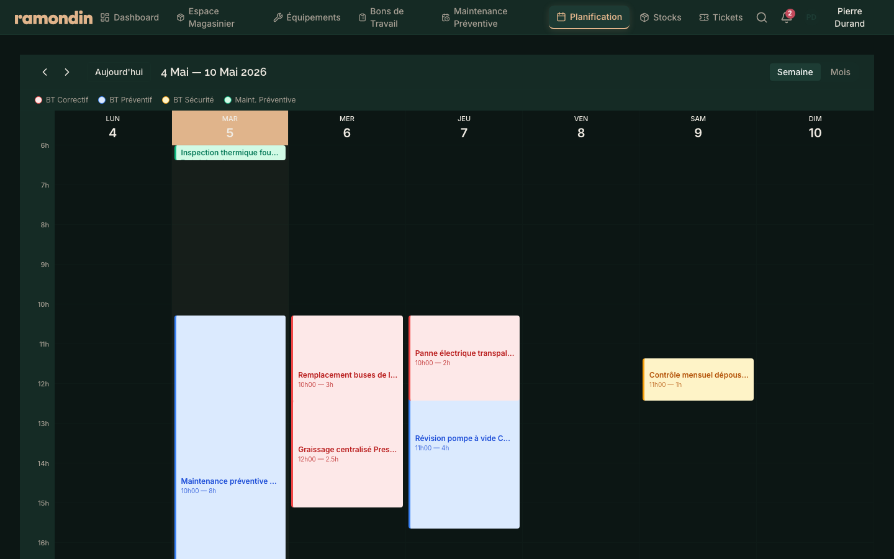
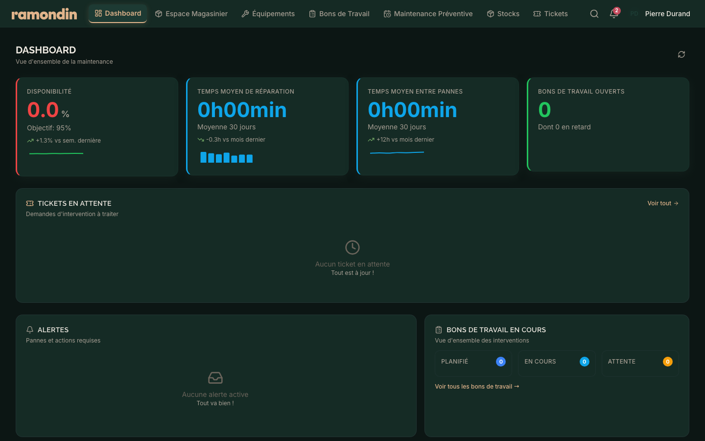
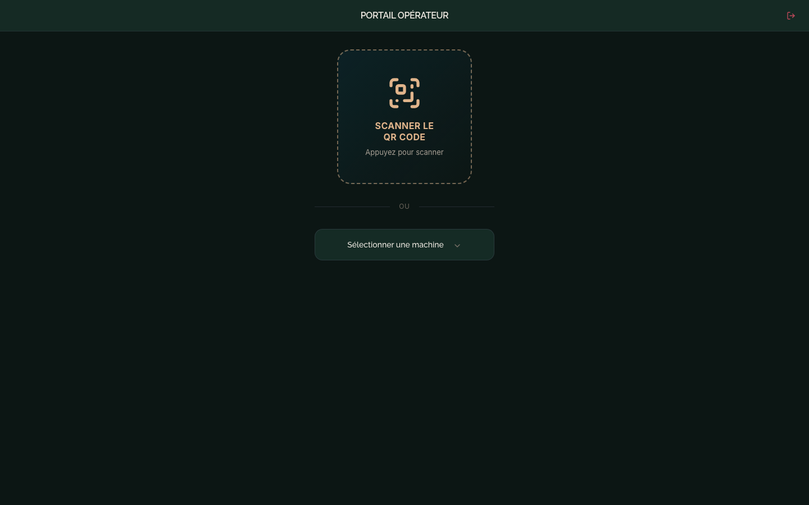

# Simply GMAO

<p align="center">
  
</p>

<p align="center">
  <strong>Gestion de Maintenance Assistée par Ordinateur</strong> pour l'industrie des capsules aluminium.
</p>

<p align="center">
  <a href="https://gmao-ramondin-demo.vercel.app" target="_blank">
    
  </a>
  
  
  
  
  
</p>

---

## 📋 Table des matières

- [Vue d'ensemble](#-vue-densemble)
- [Fonctionnalités](#-fonctionnalités)
- [Architecture](#-architecture)
- [Stack technique](#-stack-technique)
- [Installation](#-installation)
- [Déploiement](#-déploiement)
- [Captures d'écran](#-captures-décran)
- [Feuille de route](#-feuille-de-route)
- [Licence](#-licence)

---

## 🎯 Vue d'ensemble

**Simply GMAO** est une application web complète de gestion de maintenance conçue pour les PME industrielles, et plus particulièrement pour le secteur de la fabrication de capsules aluminium.

L'application couvre l'ensemble du cycle de vie de la maintenance : de la déclaration de panne par l'opérateur de production jusqu'à la planification préventive, en passant par la gestion des stocks de pièces détachées et le suivi des interventions.

🔗 **Démo en ligne** : [https://gmao-ramondin-demo.vercel.app](https://gmao-ramondin-demo.vercel.app)

> **Identifiants de démo** :
> - Responsable : `resp` / `responsable`
> - Technicien : `tech` / `technicien`
> - Opérateur : `op` / `operateur`
> - Magasinier : `mag` / `magasinier`
> - HSE : `hse` / `hse`

---

## ✨ Fonctionnalités

### 🔧 Gestion des équipements
- Arbre hiérarchique des équipements (site → atelier → ligne → machine)
- Fiches équipement avec QR code génération
- Matrice de criticité (impact × criticité)
- Historique complet des interventions
- Gestion des pièces de rechange associées

### 📋 Bons de travail
- Création et suivi des interventions correctives
- Workflow complet : à planifier → en cours → attente pièces → terminé
- Vue Kanban, liste et calendrier
- Filtrage avancé par statut, priorité, équipement, technicien
- Historique des changements de statut

### 📅 Planification
- Calendrier interactif style Google Calendar (semaine / mois)
- Blocs colorés par type d'intervention (corrective, préventive, sécurité)
- Planification des maintenances préventives
- Modale de détail au clic

### 🏭 Portail Opérateur
- Interface simplifiée pour les opérateurs de production
- Déclaration rapide de pannes avec sélection d'équipement
- Liste des pannes déclarées avec statut

### 📦 Gestion des stocks
- Inventaire des pièces de rechange
- Seuils d'alerte (stock critique / alerte)
- Mouvements de stock (entrées / sorties)
- Espace magasinier dédié

### 👥 Gestion des utilisateurs
- Authentification par rôle (Responsable, Technicien, Opérateur, Magasinier, HSE)
- Contrôle d'accès granulaire par page et par fonctionnalité

### 📊 Tableaux de bord
- KPIs temps réel (MTBF, taux de disponibilité, backlog)
- Dashboard spécifique par rôle
- Indicateurs de performance maintenance

---

## 🏗 Architecture

```
┌─────────────────────────────────────────────────────────────┐
│                      FRONTEND (Vite + React)                │
│  ┌──────────┐ ┌──────────┐ ┌──────────┐ ┌──────────┐       │
│  │ Dashboard│ │Planificat│ │Équipement│ │  Stocks  │       │
│  └──────────┘ └──────────┘ └──────────┘ └──────────┘       │
│  ┌──────────┐ ┌──────────┐ ┌──────────┐                    │
│  │   BTs    │ │  Portail │ │ Magasinier│                   │
│  └──────────┘ └──────────┘ └──────────┘                    │
└─────────────────────────────────────────────────────────────┘
                              │
                              ▼ REST API
┌─────────────────────────────────────────────────────────────┐
│                      BACKEND (Express)                      │
│  ┌──────────┐ ┌──────────┐ ┌──────────┐ ┌──────────┐       │
│  │   Auth   │ │Equipments│ │   BTs    │ │  Stocks  │       │
│  └──────────┘ └──────────┘ └──────────┘ └──────────┘       │
│  ┌──────────┐ ┌──────────┐ ┌──────────┐                    │
│  │  Tickets │ │Preventive│ │ Documents│                   │
│  └──────────┘ └──────────┘ └──────────┘                    │
│                                                             │
│  ┌──────────┐ ┌──────────┐ ┌──────────┐                    │
│  │  Prisma  │ │  Redis   │ │ BullMQ   │                    │
│  │  (ORM)   │ │ (Cache)  │ │ (Queues) │                    │
│  └──────────┘ └──────────┘ └──────────┘                    │
└─────────────────────────────────────────────────────────────┘
                              │
                              ▼ SQL
┌─────────────────────────────────────────────────────────────┐
│                    PostgreSQL 16                            │
└─────────────────────────────────────────────────────────────┘
```

---

## 🛠 Stack technique

### Frontend
| Technologie | Version | Usage |
|-------------|---------|-------|
| React | 19 | UI library |
| TypeScript | 5.7 | Typage statique |
| Vite | 6 | Bundler & dev server |
| Tailwind CSS | 4 | Styling utility-first |
| shadcn/ui | — | Composants UI accessibles |
| Framer Motion | 12 | Animations |
| Recharts | 2 | Graphiques & KPIs |
| Zustand | 5 | State management |
| React Router | 7 | Routing |

### Backend
| Technologie | Version | Usage |
|-------------|---------|-------|
| Node.js | 22 | Runtime |
| Express | 4 | Framework API |
| Prisma | 6 | ORM & migrations |
| PostgreSQL | 16 | Base de données |
| Redis | 7 | Cache & sessions |
| BullMQ | 5 | File d'attente de jobs |
| Zod | 3 | Validation des schémas |
| JWT | — | Authentification |

### DevOps & Outils
| Outil | Usage |
|-------|-------|
| Vercel | Déploiement frontend |
| Docker | Containerisation backend |
| Playwright | Tests E2E & screenshots |
| ESLint | Linting |

---

## 🚀 Installation

### Prérequis
- Node.js ≥ 22
- PostgreSQL ≥ 16
- Redis ≥ 7

### 1. Cloner le repository

```bash
git clone https://github.com/doulicane/simply-gmao.git
cd simply-gmao/app
```

### 2. Installer les dépendances

```bash
# Frontend
npm install

# Backend
cd backend
npm install
```

### 3. Configurer les variables d'environnement

```bash
# Backend
cp backend/.env.example backend/.env
# Éditer backend/.env avec vos credentials PostgreSQL et Redis
```

### 4. Initialiser la base de données

```bash
cd backend
npx prisma migrate dev
npx prisma db seed
```

### 5. Démarrer les serveurs

```bash
# Terminal 1 — Backend
cd backend
npm run dev

# Terminal 2 — Frontend
cd app
npm run dev
```

L'application est accessible sur `http://localhost:5173` et l'API sur `http://localhost:3001`.

---

## 🌐 Déploiement

### Frontend (Vercel)

Le frontend est déployé automatiquement sur Vercel en mode statique avec des données mockées :

```bash
cd app
npm run build
vercel --prod
```

Configuration : `app/vercel.json` (SPA routing)

### Backend (Docker)

```bash
cd backend
docker-compose up -d
```

Le backend est containerisé avec PostgreSQL, Redis, Nginx et l'API Node.js.

---

## 📸 Captures d'écran

| Dashboard Responsable | Planification | Équipements |
|:---:|:---:|:---:|
|  |  |  |

| Bons de Travail | Stocks | Portail Opérateur |
|:---:|:---:|:---:|
|  |  |  |

> Toutes les captures sont disponibles dans le dossier [`app/screenshots/`](app/screenshots/).

---

## 🗺 Feuille de route

- [x] MVP V1 — Dashboard, équipements, BTs, stocks
- [x] MVP V2 — Planification calendrier, portail opérateur, rôles
- [ ] V3 — Collecte données automates (Modbus/OPC-UA)
- [ ] V4 — Génération de rapports PDF/Excel
- [ ] V5 — Application mobile (PWA / React Native)
- [ ] V6 — Intelligence prédictive (ML)

Consultez [`ramondin_gmao_roadmap_dev.md`](ramondin_gmao_roadmap_dev.md) pour le détail complet.

---

## 📝 Licence

Projet interne — Tous droits réservés © Ramondin.

---

<p align="center">
  Développé avec ❤️ pour la maintenance industrielle.
</p>
